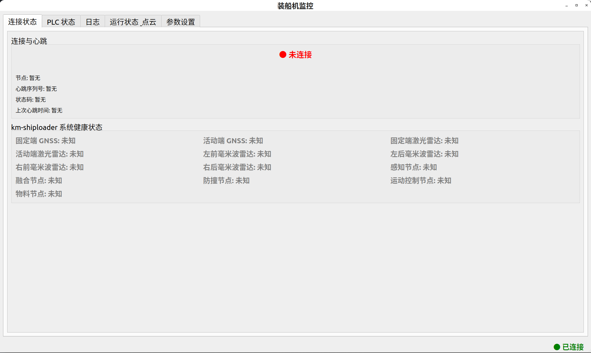
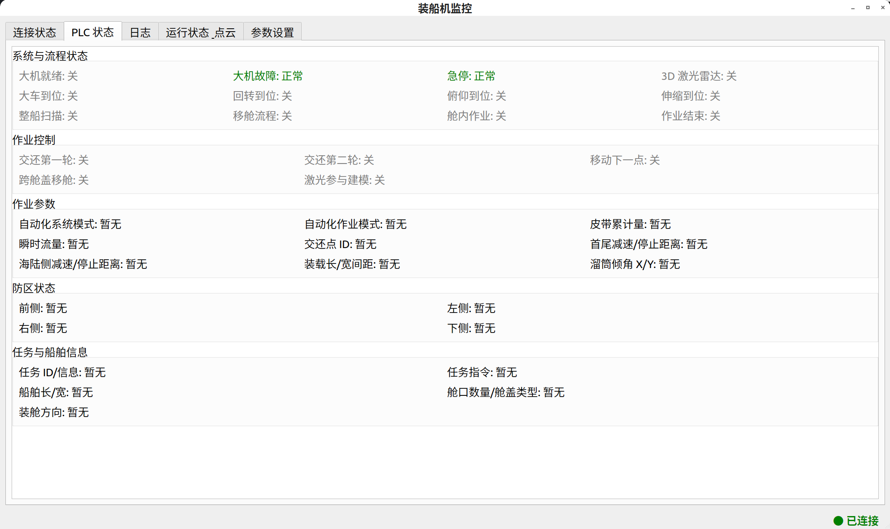
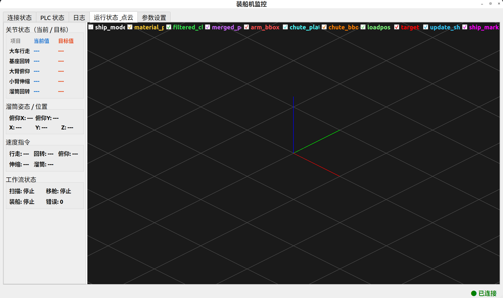
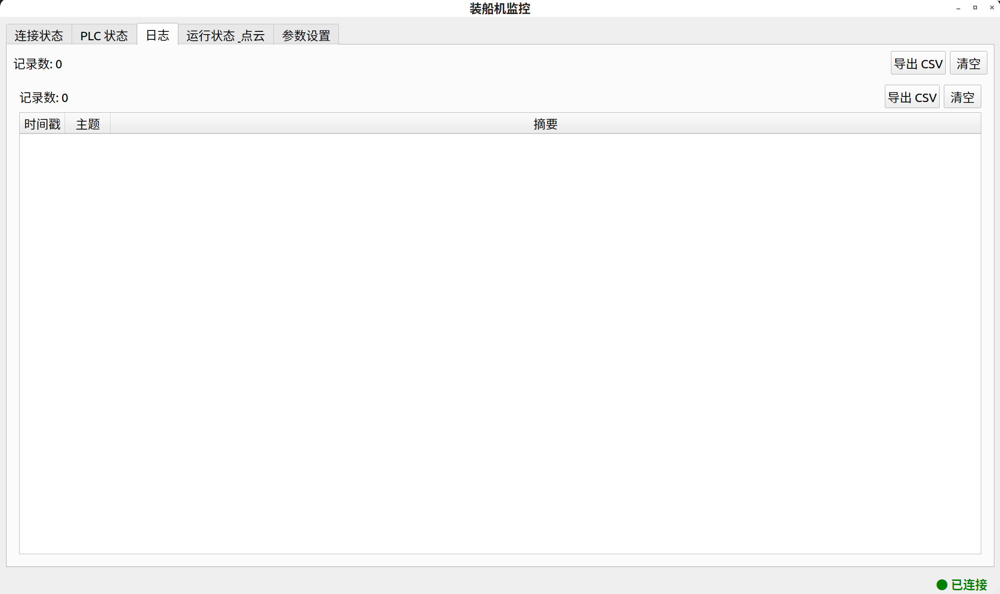
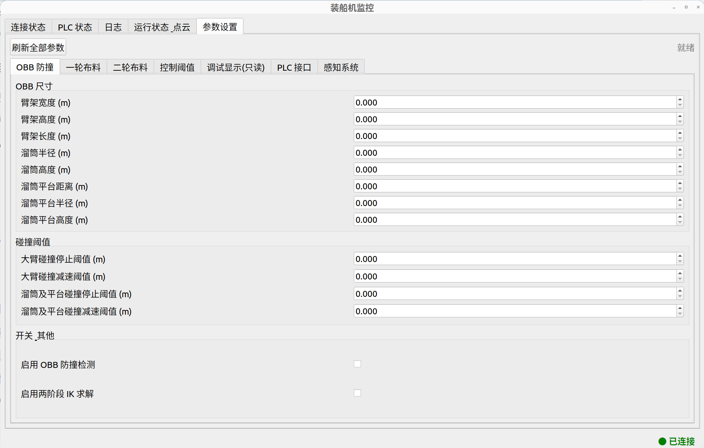

# 装船机监控系统（ShipLoader Monitor）调试手册

> 适用版本：0.1.0
> 面向对象：现场调试人员、售后技术支持
> 更新日期：2026-08-06

---

## 目录

1. [系统概述](#1-系统概述)
2. [主窗口布局](#2-主窗口布局)
3. [子页面一：连接状态](#3-子页面一连接状态)
4. [子页面二：PLC 状态](#4-子页面二plc-状态)
5. [子页面三：运行状态 & 点云](#5-子页面三运行状态--点云)
6. [子页面四：日志](#6-子页面四日志)
7. [子页面五：参数设置](#7-子页面五参数设置)
8. [配置文件说明](#8-配置文件说明)
9. [调试技巧汇总](#9-调试技巧汇总)

---

## 1. 系统概述

本软件是 **装船机自动化系统的上位机监控界面**，基于 **Qt 5 + ROS 2** 开发，运行在司机室/控制室的工控机上。它通过订阅 ROS 2 话题实时显示装船机各子系统（PLC、运动控制、感知、防撞、物料）的运行状态，并允许调试人员在线修改部分控制参数。

软件本体只做 **显示与参数下发**，不参与核心控制逻辑。真正执行控制的是以下 ROS 节点：

| 节点名 | 职责 | 本软件读写方式 |
|---|---|---|
| `plc_interface_node` | 与 PLC 通讯，读写工艺参数 | 订阅状态 / 写参数 |
| `motion_node` | 运动控制、布料规划、防撞 | 订阅状态 / 读参数 / 写参数 |
| `perception_node` | 舱口/料面感知 | 读参数 / 写参数 |
| `material_distribution_node` | 物料分布计算 | 读参数 / 写参数 |
| `km-shiploader` 其他节点 | 系统健康状态上报 | 只读 |

### 启动方式

通过 ROS 2 launch 启动：

```bash
ros2 launch shiploader_monitor monitor.launch.py
```

或直接运行可执行文件（需先 `source install/setup.bash`）。

> 提示：界面右下角状态栏显示 **● 已连接 / ● 未连接**，表示本软件与 ROS 2 系统的连接状态。绿色 = 正常，红色 = 未连上（检查 ROS 环境与节点是否启动）。

---

## 2. 主窗口布局

主窗口共 **5 个子页面**（Tab），自左向右排列：

| Tab | 页面名称 | 对应组件 | 主要用途 |
|---|---|---|---|
| 1 | 连接状态 | HeartbeatWidget | 系统心跳、各子系统健康状态 |
| 2 | PLC 状态 | PlcStatusWidget | PLC 各状态位、工艺参数、防区、任务信息 |
| 3 | 运行状态 & 点云 | StatusWidget + PointCloudWidget | 关节/速度/工作流状态 + 3D 点云与包围盒可视化 |
| 4 | 日志 | LogWidget | 历史数据记录、导出 CSV |
| 5 | 参数设置 | ParamEditWidget | 在线修改运动/感知/物料/PLC 接口参数 |

窗口尺寸、位置、日志条数、刷新频率等由配置文件管理（见 [第 8 节](#8-配置文件说明)）。

---

## 3. 子页面一：连接状态



### 3.1 功能说明

本页显示装船机自动化系统与各子系统的 **通信健康状态**，是判断"整个系统是否正常"的第一入口。

页面分为上下两块：

- **连接与心跳**：显示 ROS 心跳消息（`/heartbeat`）的接收情况。只要有任意一次心跳到达，即判定为"已连接"。
- **km-shiploader 系统健康状态**：显示 13 个关键子系统/传感器的状态码（来自 `/status_code` 话题），每个部件有三种状态：

| 状态码 | 含义 | 显示颜色 |
|---|---|---|
| 0 | 正常 | 绿色 |
| 1 | 超时 | 红色 |
| 2 | 数据未更新 | 橙色 |
| 其他 | 未知 | 灰色 |

### 3.2 字段含义

| 字段 | 含义 |
|---|---|
| 节点 | 最近一次心跳的来源节点名 |
| 心跳序列号 | 心跳包序号，正常应连续递增；跳号说明有丢包 |
| 状态码 | 心跳携带的系统状态码 |
| 上次心跳时间 | 最近一次收到心跳的时刻（精确到毫秒） |

**心跳超时预警**（页面中间橙色/红色提示）：

- 超过 **1.5 秒** 未收到心跳 → 提示"心跳延迟"（橙色）
- 超过 **3 秒** 未收到心跳 → 提示"心跳超时"（红色）

> **调试要点**：健康状态里哪一项变红/变橙，就说明对应传感器或节点通讯有问题。例如"固定端 GNSS 超时"→ 检查 GNSS 设备电源与网络；"感知节点超时"→ 检查 `perception_node` 进程。

### 3.3 健康状态项一览

| 显示名 | 对应硬件/节点 |
|---|---|
| 固定端 GNSS / 活动端 GNSS | 两台北斗/GNSS 定位设备 |
| 固定端激光雷达 / 活动端激光雷达 | 两台 3D 激光雷达 |
| 左前/左后/右前/右后毫米波雷达 | 四角毫米波雷达 |
| 感知节点 / 融合节点 / 防撞节点 | 对应 ROS 节点 |
| 运动控制节点 / 物料节点 | 对应 ROS 节点 |

---

## 4. 子页面二：PLC 状态



### 4.1 功能说明

本页将 PLC 上报的布尔状态位、数值参数、防区信息和任务信息分五个组展示（数据源 `/plc_status`）。

> **调试要点**：现场排查"为什么机器不动 / 为什么不执行流程"时，先看本页各状态位是否满足前置条件。例如"大机就绪"未亮、"回转到位"为关等，都会导致运动指令不执行。

### 4.2 分组说明

**① 系统与流程状态**（12 项开关量）

| 状态位 | 含义 | 颜色 |
|---|---|---|
| 大机就绪 | PLC 是否就绪 | 开=绿 / 关=灰 |
| 大机故障 | 大机是否有故障 | 告警=红 / 正常=绿 |
| 急停 | 急停按钮是否触发 | 告警=红 / 正常=绿 |
| 3D 激光雷达 | 雷达电源是否开启 | 开=绿 / 关=灰 |
| 大车到位 | 大车行走是否到位 | 开=绿 / 关=灰 |
| 回转到位 | 基座回转是否到位 | 开=绿 / 关=灰 |
| 俯仰到位 | 大臂俯仰是否到位 | 开=绿 / 关=灰 |
| 伸缩到位 | 小臂伸缩是否到位 | 开=绿 / 关=灰 |
| 整船扫描 | 是否处于整船扫描流程 | 开=绿 / 关=灰 |
| 移舱流程 | 是否处于移舱流程 | 开=绿 / 关=灰 |
| 舱内作业 | 是否处于舱内布料作业 | 开=绿 / 关=灰 |
| 作业结束 | 本舱作业是否结束 | 开=绿 / 关=灰 |

**② 作业控制**（5 项）：交还第一轮 / 交还第二轮 / 移动下一点 / 跨舱盖移舱 / 激光参与建模。

**③ 作业参数**（9 项数值）：

| 字段 | 含义 |
|---|---|
| 自动化系统模式 | PLC 侧自动化模式号 |
| 自动化作业模式 | 当前作业模式（如一轮/二轮） |
| 皮带累计量 | 当前累计装载量（吨） |
| 瞬时流量 | 皮带瞬时流量（吨/时） |
| 交还点 ID | 布料交还位置编号 |
| 首尾减速/停止距离 | 船首尾方向减速与停止触发距离（米） |
| 海陆侧减速/停止距离 | 海侧/陆侧方向减速与停止触发距离（米） |
| 装载长/宽间距 | 布料点长、宽方向间距（米） |
| 溜筒倾角 X/Y | 溜筒当前俯仰角度 X/Y（度） |

> 以上数值均来自 PLC，为 **只读显示**，如需调整请通过 PLC 或参数设置页修改对应项。

**④ 防区状态**（4 项）：前侧 / 左侧 / 右侧 / 下侧，每项显示状态码与到障碍物距离（米）。状态码为 0 表示无触发，非 0 表示对应方向防区报警。

**⑤ 任务与船舶信息**：任务 ID/信息、任务指令、船舶长/宽、舱口数量/舱盖类型、装舱方向（船头到船尾 / 船尾到船头）。

---

## 5. 子页面三：运行状态 & 点云



本页为左右分栏：**左侧为运行状态文字面板**，**右侧为 3D 点云可视化**。

### 5.1 左栏：运行状态（StatusWidget）

**① 关节状态（当前 / 目标）** —— 当前值（蓝色）与目标值（橙色）同屏对比：

| 关节 | 单位 |
|---|---|
| 大车行走 | 米 |
| 基座回转 | 度 |
| 大臂俯仰 | 度 |
| 小臂伸缩 | 米 |
| 溜筒回转 | 度 |

> **调试要点**：判断运动是否到位、是否有跟踪误差，看当前值与目标值是否一致。若目标值长期不变而当前值不动，说明指令没下发（查 PLC 状态前置位）。

**② 溜筒姿态 / 位置**：溜筒俯仰 X/Y（度）、溜筒末端空间位置 X/Y/Z（米）。

**③ 速度指令**：五个关节的运动方向与速度数值（行走前进/后退、回转右/左转、俯仰上仰/下俯、伸缩伸出/缩回、溜筒右/左转）。

**④ 工作流状态**：

| 字段 | 状态值 |
|---|---|
| 扫描 | 停止/运行中/完成/异常/初始化 |
| 移舱 | 停止/运行中/完成/异常/初始化 |
| 装船 | 停止/运行中/完成/异常/初始化 |
| 错误 | 错误码（非 0 表示有错误，需结合日志排查） |

### 5.2 右栏：3D 点云显示（PointCloudWidget）

本栏用 OpenGL 渲染多路点云与包围盒线框，顶部有话题显示开关（复选框），**可单独隐藏/显示任意图层**，便于隔离排查。

**图层颜色对照**：

| 话题 | 显示名 | 颜色 | 内容 |
|---|---|---|---|
| `/ship_model_point_cloud` | ship_model_point_cloud | 白色 | 船体模型点云 |
| `/material_point_cloud` | material_point_cloud | 黄色 | 物料点云 |
| `/filtered_cloud` | filtered_cloud | 绿色 | 滤波后的点云 |
| `/merged_points` | merged_points | 紫色 | 融合点云 |
| `/rviz_arm_bbox` | arm_bbox | 红色 | 臂架碰撞包围盒 |
| `/rviz_chute_platform_bbox` | chute_platform_bbox | 青色 | 溜筒平台包围盒 |
| `/rviz_chute_bbox` | chute_bbox | 橙色 | 溜筒碰撞包围盒 |
| `/rviz_loadpos` | loadpos | 浅绿 | 布料装载位置标记 |
| `/rviz_target` | target | 红色 | 当前目标位置标记 |
| `/update_ship_attitude_markers` | update_ship_markers | 天蓝 | 船姿态更新标记 |
| `/ship_attitude_markers` | ship_markers | 品红 | 船姿态标记 |

**鼠标/键盘操作**：

| 操作 | 效果 |
|---|---|
| 左键拖拽 | 旋转视角 |
| 中键拖拽 | 平移视角 |
| 滚轮 | 缩放 |
| **空格键** | 复位视角 |

> **调试要点**：
> - 核对"臂架/溜筒包围盒"与真实船体、舱口点云是否贴合。若包围盒与点云相交，说明防撞触发，运动会被限制。
> - 查看 `/rviz_target`（目标标记）是否落在合法料区，辅助判断布料规划是否正常。

---

## 6. 子页面四：日志



### 6.1 功能说明

集中记录各订阅话题的关键数据变化（时间戳 / 主题 / 摘要），按时间顺序滚动显示，最多保留最近 **1000 条**（可在配置文件调整）。

- **导出 CSV**：将当前全部历史记录导出为 CSV 文件，供离线分析（导出失败会在右下角状态栏提示）。
- **清空**：清空全部历史记录。

> **调试要点**：日志摘要包含每条消息的关键字段（如 PLC 的就绪/扫描/装船状态、位姿关节值、心跳序号等），现场可导出 CSV 后用于事后分析动作时序是否正确。

---

## 7. 子页面五：参数设置



> **重要操作提示**
> - 本页参数通过 ROS 参数服务 **在线写入** 对应运行节点，**改动立即生效**，无需重启。
> - 点击 **「刷新全部参数」** 可从运行节点重新读取当前值，避免界面与节点不同步。
> - 参数分两类：
>   - **✅ 可调**：调试人员可现场调整的工艺/算法参数，手册给出含义与建议。
>   - **🔒 勿动**：重要参数（设备结构、安全、通讯类），**不建议修改**；误改可能导致防撞失效、通讯中断或设备损坏。如需修改请联系研发。
> - 参数改动是**运行时写入**，节点重启后以节点自身配置为准（本软件不负责持久化参数）。

页面顶部按钮含义：

| 按钮 | 功能 |
|---|---|
| 刷新全部参数 | 从 4 个运行节点重新拉取本页全部参数当前值 |
| 右上角状态文字 | 显示最近一次"刷新/写入"结果（绿色=成功，红色=失败） |

---

### 7.1 Tab「OBB 防撞」（motion_node）

本页参数用于 **碰撞检测的碰撞体建模与安全阈值**。

#### 🔒 勿动 —— OBB 尺寸组（碰撞体几何尺寸）

以下参数对应装船机 **实际机械结构尺寸**，是防撞计算的几何模型。修改后碰撞体与真实结构不一致，**防撞检测将失效，有碰撞风险**。

| 参数名 | 对应结构 |
|---|---|
| `d_obb.arm_width` | 臂架宽度 |
| `d_obb.arm_height` | 臂架高度 |
| `d_obb.arm_length` | 臂架长度 |
| `d_obb.chute_radius` | 溜筒半径 |
| `d_obb.chute_height` | 溜筒高度 |
| `d_obb.chute_platform_distance` | 溜筒平台距离 |
| `d_obb.chute_platform_radius` | 溜筒平台半径 |
| `d_obb.chute_platform_height` | 溜筒平台高度 |

#### 🔒 勿动 —— 碰撞阈值组（安全阈值）

| 参数名 | 说明 |
|---|---|
| `c_大臂碰撞停止阈值` | 大臂碰撞距离达到该值即**紧急停止** |
| `c_大臂碰撞减速阈值` | 大臂碰撞距离达到该值即**减速** |
| `c_溜筒及平台碰撞停止阈值` | 溜筒及溜筒平台碰撞距离达到该值即**紧急停止** |
| `c_溜筒及平台碰撞减速阈值` | 溜筒及溜筒平台碰撞距离达到该值即**减速** |

> 这四项是安全兜底距离，改小可能来不及停车，改大可能频繁误停。如需调整请联系研发。

#### 开关 & 其他

| 参数名 | 类型 | 类别 | 含义与建议 |
|---|---|---|---|
| `a_启用OBB防撞检测` | 开关 | 🔒 勿动 | 防撞功能**总开关**。关闭后整机失去防撞保护，禁止在现场关闭 |
| `a_启用两阶段IK求解` | 开关 | ✅ 可调 | 逆运动学求解策略。当出现"目标点求解失败/无解"时可切换此开关试验另一套求解流程 |

---

### 7.2 Tab「一轮布料」（motion_node）

首轮布料（底层大面摊铺）的规划参数，**全部为可调参数**。

| 参数名 | 单位 | 含义与调节建议 |
|---|---|---|
| `a_first左侧安全距离` | 米 | 布料范围距舱口**左侧**的收边距离。船宽不同可适当调整，防止布料溢出舱口或触碰舱壁 |
| `a_first右侧安全距离` | 米 | 布料范围距舱口**右侧**的收边距离，同左 |
| `a_first海测安全距离` | 米 | 距**海侧**（靠海方向）舱壁的收边距离 |
| `a_first路测安全距离` | 米 | 距**陆侧**（靠岸方向）舱壁的收边距离 |
| `a_first中线布料点间距` | 米 | 中线往返路径上相邻布料点的间距。**越小布料越密**（料面越平，耗时越长）；现场料面平整度不足时调小，反之调大 |

> 建议：安全距离取值不宜小于舱口机械极限留量；若发现布料堆到舱壁或溢出，优先增大对应侧安全距离。

---

### 7.3 Tab「二轮布料」（motion_node）

二轮布料（在上轮料面上进行补平/找平）的规划参数，含 **动态补料** 功能参数。

#### 安全距离（✅ 可调）

| 参数名 | 单位 | 含义 |
|---|---|---|
| `b_second左侧安全距离` | 米 | 二轮布料距左侧舱壁收边距离 |
| `b_second右侧安全距离` | 米 | 二轮布料距右侧舱壁收边距离 |
| `b_second海测安全距离` | 米 | 二轮布料距海侧舱壁收边距离 |
| `b_second路测安全距离` | 米 | 二轮布料距陆侧舱壁收边距离 |
| `b_second蛇形布料点间距` | 米 | 蛇形路径相邻布料点间距，越小越密 |

#### 动态补料参数（✅ 可调，二轮布料的核心调优点）

动态补料 = 依据实时料面点云自动在低洼处补充布料。以下参数组合决定"补多少、补哪、多快达标"。

| 参数名 | 类型/单位 | 含义与调节建议 |
|---|---|---|
| `b_second启用动态补料` | 开关 | 二轮布料是否启用动态补料。关闭后按固定蛇形路径布料 |
| `b_second动态补料Y间隔` | 米 | 动态补料扫描行的 Y 向间隔。**越小越精细**、计算量越大 |
| `b_second动态补料采样半径` | 米 | 料面采样邻域半径，决定每点取多大范围的点云求平均高度 |
| `b_second动态补料最小采样点数` | 个 | 邻域内有效点少于该值则视为无数据（点云稀疏时提高采样半径或降低该值） |
| `b_second动态补料最大点数` | 个 | 一次规划的最大布料点数，防止规划过多 |
| `b_second动态补料料面权重` | 0~100 | 高度差（缺料量）在补料排序中的权重。**越大越优先补低洼处** |
| `b_second动态补料移动代价权重` | 0~100 | 行走代价权重，越大越优先就近补料、减少大车来回移动 |
| `b_second动态补料方向权重` | 0~100 | 方向一致性权重，越大越优先沿当前方向补料 |
| `b_second动态补料达标容差` | 米 | 料面高度差小于该值即认为该点"达标" |
| `b_second动态补料达标连续次数` | 次 | 某点连续 N 次达标才判定补料完成，防抖动 |
| `b_second动态补料选中后蛇形执行` | 开关 | 动态补料完成后是否按蛇形路径收尾 |
| `b_second动态补料目标料面偏移` | 米 | 目标料面高度的附加偏移，正值多布料、负值少布料 |
| `b_second动态补料点云最大延迟` | 秒 | 允许的点云数据最大延迟，超过则认为点云过期不可用 |
| `b_second动态补料无点云时回退固定规划` | 开关 | 无有效点云时自动回退到固定蛇形规划，保证不停机 |

> **动态补料调优思路**：
> 1. 现象"该补的地方没补" → 增大料面权重、降低移动代价权重、增大采样半径。
> 2. 现象"补料点过密/过多" → 增大 Y 间隔、降低最大点数。
> 3. 现象"补料反复抖动/不收敛" → 增大达标连续次数、增大达标容差。
> 4. 现象"有时完全不补" → 检查点云最大延迟是否太小、无点云回退是否被关闭。

---

### 7.4 Tab「控制阈值」（motion_node）

布料执行过程中的高度/角度限位与偏载检测阈值，**全部为可调参数**。

#### 控制阈值组

| 参数名 | 类型/单位 | 含义与调节建议 |
|---|---|---|
| `c_布料溜筒最低高度` | 米 | 布料时溜筒允许到达的最低高度，防止溜筒插入料堆/触碰舱底。**调小有刮擦风险** |
| `c_布料俯仰最大角度` | 度 | 布料时俯仰允许的最大角度限位 |
| `c_布料舱口高度偏移量` | 米 | 布料时溜筒高度相对舱口平面的**基准偏移量**，正值抬升、负值降低。用于微调布料高度基准；发现布料高度整体偏高/偏低时可小幅调整 |
| `move_point_height_offset` | 米 | 换点时抬升的高度偏移量，用于避免换点途中刮料。料堆较高时可适当增大 |

#### 偏载纠偏参数组

偏载 = 舱内料面左右不平衡导致大机偏斜，系统自动纠偏。以下参数决定"何时判定偏载 / 何时恢复正常"。

| 参数名 | 类型/单位 | 含义与调节建议 |
|---|---|---|
| `b_second偏载进入角度阈值` | 度 | 倾斜角**超过**该值判定进入偏载状态，触发纠偏 |
| `b_second偏载退出角度阈值` | 度 | 倾斜角**小于**该值判定偏载恢复 |
| `b_second严重偏载角度阈值` | 度 | 超过该值判定**严重偏载**，采取更激进干预 |
| `b_second偏载触发连续次数` | 次 | 连续 N 次满足条件才确认进入偏载，防瞬时抖动误判 |
| `b_second偏载恢复连续次数` | 次 | 连续 N 次满足条件才确认偏载恢复 |

> 建议：进入阈值应显著大于退出阈值（滞回），避免在临界角来回切换；若现场频繁误报偏载，适当增大进入阈值与触发连续次数。

---

### 7.5 Tab「调试显示（只读）」（motion_node）

本页全部为 **只读显示**，不可编辑，用于现场观察运动控制的内部中间量，辅助定位问题。

主要分组：

| 分组 | 内容 | 调试用途 |
|---|---|---|
| 溜筒位置 | 溜筒末端 X/Y/Z | 核对溜筒实际空间位置 |
| 目标关节/位置 | 目标行走距离、回转/俯仰角度、伸缩距离、目标 XYZ、目标有效 | 核对当前规划目标 |
| 臂架碰撞距离 | 臂架四边（陆侧/船头/海侧/船尾）距障碍距离 + 最小距离 | 观察防撞余量，判断是否会触发减速/停止 |
| 溜筒碰撞距离 | 溜筒四边距离 + 最小距离 | 同上 |
| 溜筒平台碰撞距离 | 溜筒平台四边距离 + 最小距离 | 同上 |
| Cover Diff | 舱盖边顶部 Z 差值 | 舱盖检测 |
| 高度检测 | 溜筒到料面距离、移动检测高度、原始/干预目标高度、预计移动重量、当前/目标料面高度、料面高度缺口、料面数据有效 | 动态补料与高度干预的现场诊断 |

> **调试要点**：当防撞意外触发时，观察"臂架/溜筒最小距离"接近 0 的一侧是哪条边，配合 3D 点云视图快速定位是哪一侧、什么物体触发。

---

### 7.6 Tab「PLC 接口」（plc_interface_node）

| 参数名 | 类型 | 类别 | 说明 |
|---|---|---|---|
| `read_plc_port` | 整数（端口号） | 🔒 勿动 | PLC **读取端口**。修改会导致与 PLC 通讯中断 |
| `write_plc_port` | 整数（端口号） | 🔒 勿动 | PLC **写入端口**。修改会导致与 PLC 通讯中断 |

> 此二项为 PLC 通讯配置，与现场网口/PLC 组态绑定，禁止现场改动。

---

### 7.7 Tab「感知系统」（perception_node / material_distribution_node）

舱口与料面感知的检测阈值，**全部为可调参数**。

| 参数名 | 所属节点 | 单位 | 含义与调节建议 |
|---|---|---|---|
| `height_diff` | perception_node | 米 | 舱口高度差检测阈值。识别舱口边界时，超过该高度差才判定为舱口沿；误检时适当增大 |
| `line_thres` | perception_node | - | 感知线离散度阈值（直线拟合/边缘离散程度判定）。线提取不稳时调整 |
| `hatch_min_length` | perception_node | 米 | 舱口**最小长度**滤波阈值。识别出的舱口长度小于该值视为误检（过滤短线段/小目标）；误检为短杂线时适当增大 |
| `hatch_max_length` | perception_node | 米 | 舱口**最大长度**滤波阈值。识别出的舱口长度大于该值视为误检（过滤跨舱合并等异常）；多个舱口被误并成一条长线时适当减小 |
| `material_height_diff` | material_distribution_node | 米 | 物料舱口高度差阈值，用于区分物料与舱壁高度差（界面显示名即此名，底层映射到该节点的 `height_diff` 参数） |
| `update_threshold` | material_distribution_node | 米 | 舱口位置更新阈值，感知位置变化超过该值才更新舱口坐标，用于滤波防抖 |

> **调试要点**：
> - 舱口边缘误识别/漏识别 → 调整 `height_diff` 与 `line_thres`。
> - 舱口位置跳动频繁 → 适当增大 `update_threshold`。

---

## 8. 配置文件说明

配置文件 `config/default.yaml` 管理界面本身的运行参数（**不影响控制节点**）。加载优先级：

1. 用户目录下的 `default.yaml`（`~/.config/.../default.yaml`，程序退出时自动保存窗口位置等）；
2. 无则读取安装包内 `config/default.yaml`；
3. 均无则使用程序内置默认值。

```yaml
window:
  width: 1280        # 窗口宽（像素，退出时自动保存，可改）
  height: 800        # 窗口高（像素）
  pos_x: 100         # 窗口 X 位置
  pos_y: 100         # 窗口 Y 位置

data:
  history_max_size: 1000      # ✅ 日志面板保留的最大记录条数（调大更占内存）
  refresh_interval_ms: 200    # ✅ 界面刷新周期（毫秒）。现场卡顿可调大到 300~500；
                              #   数据更新不及时可调小到 100，不建议低于 100
  export_path: ""             # 日志导出默认路径（留空则每次手动选择）

# 各话题订阅开关，false 即不订阅对应话题
topics:
  /plc_status: true
  /shiploader_pos: true
  /heartbeat: true
  /workflow_status: true
  /ship_loader_speed: true
  /ship_loader_target_pos: true
  /hatch_position: true
  /ship_model_point_cloud: true
  /material_point_cloud: true
  /filtered_cloud: true
  /merged_points: true
```

> 说明：`window.*` 与 `topics.*` 一般无需手工修改。修改 yaml 后需重启软件生效。

---

## 9. 调试技巧汇总

**通信类故障**

1. 软件右下角"未连接" → ROS 环境/DDS 问题，检查节点是否运行、网络（多机）是否可达。
2. "连接状态"页健康项变红 → 对应设备/节点超时，逐项定位。
3. PLC 数据全"暂无" → 检查 PLC 通讯（读/写端口勿动）、`plc_interface_node` 是否运行。

**运动类故障**

4. 指令不下发 → 检查 "PLC 状态"页：大机就绪、各到位信号是否满足前置条件。
5. 防撞意外触发 → "调试显示"页看臂架/溜筒/平台最小距离，配合 3D 点云定位是哪个方向、哪一侧。
6. 布料不平/漏料 → 一轮/二轮 Tab 调整布料点间距与安全距离；二轮可启用并调优动态补料参数。

**感知类故障**

7. 舱口识别不准 → "感知系统" Tab 调整高度差/离散度阈值与更新阈值。

**界面类**

8. 界面卡顿 → 增大 `refresh_interval_ms` 或减小 `history_max_size`。
9. 3D 视图视角乱了 → 按 **空格键** 复位。

---

*本手册仅覆盖当前界面与参数，参数底层含义若与实际现场工艺冲突，以研发技术文件为准。*
